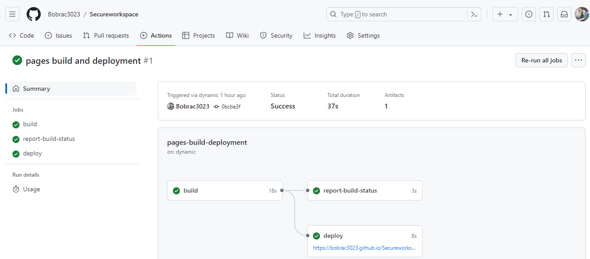

Taj Mahal – an Eternal Calling 

1. Purpose of the project. 

        "Taj Mahal - An Eternal calling" website is a "one stop" source of information that caters to users of all ages and varied interests across fields. It provides first hand information based on authors "TWO" visits to the Taj Mahal. It is supported by pictures clicked by the author and includes a "link" to a published artcile articulating the authors thoughts.
        As an example, a tourist may find useful information pertaining to "visit times" and "how to get there". Likewise anyone with interest in architecture can find useful information under "tickle your curosity" link on the landing page.Furthermore, details on the "information page" can be used to to arrive at decisons on the reasons to to visit the Taj. 
        Visitors to the website can leave their details to get in touch with the author or upload their own experiences via the "upload files and image" section under the "Contact us" page. 
 
2. Features.
        a.The website is designed using the "Mobile First" Responsive approach using a structured layout and "meta" tags.
        b.The website has four pages including the landing page.  "Home", "Information", "Gallery" and "Contact Us".
        c.The header includes the title of the website " Taj Mahal- An Eternal Calling and is common across all pages 
        d.The footer inlcudes the "copyright" and " author" details and icons for social media
        e.The chocie of foreground and background colors have the right contrast providing a rich user experience .
        d. All images, inclduing the hero image has a "alt " element to cater for the visually impaired.
        f. All images in the gallery have the right resolution when viewed across screens with different viewports.
        g. All External links open in a seperate tab -" tickle your curosity" on the home page and "best time to visit" section under the 
           information page  
        h. CSS media queires used where appropriate for different screen sizes.
        i. Masonry layout used to align images in the "Gallery" page.
        j. Relative paths are used for refering to folders and files.
        l. Favicon is used to differentiate the page in browser tab
        j. "Keywords" and "Description" incldued for search engine optimization. 
        k. "Hover" property used to hightlight pages on navigation bar, social media icons and "tickle your curosity" link on landing page.

3. Font family and colors.

        a.Google fonts used for styling. Download link below
        ('https://fonts.googleapis.com/css2?family=Lato:ital,wght@0,100;0,300;0,400;0,700;0,900;1,100;1,300;1,400;1,700;1,900&family=Oswald:wght@200..700&display=swap');
        b. Font-family used for styling : "Cursive", Courier New', Courier, monospace
        c. colors used for styling  :        aliceblue,bisque,brown,cyan,crimson,gold,lightyellow,aqua, magenta,lightcyan,
        
4. Technology used in development and testing-: 
        1.Google Chrome as the Browser.
        2.Cloud-based platform :gitpod.io and github for designing and hosting the website
        3.Devices with different viewports for testing the responsiveness - Galaxy A54, iPhone 14 Pro, Galaxy A25, Asus AMD Ryzen7 4800H with 
           Radeon Graphics    
    
5. Website Page and feature Description 
    a.Home page ( landing page) : - 
        This page is divided into three sections, namely the header, main and footer section. This page is the landing page which greets the user when the url is clicked. The landing page has a header with the title " The Taj- An Eternal Calling" , navigation links to the other pages. These navigation links change color when the user hovers the mouse over it 
        Inside the hero image just below the header, in the center is another link named"architecture of the taj" which opens in a new external page. The  image explains the architecture of the taj and has been sourced from an external source 
        The footer section display the authorship of the website, copyright information and the social media icons
    b.Information page: 
        The information page has header titled" !!! Explore the modern wonder of the world!!!, followed by a short paragraph. The paragraph, outlines what the user would experience when he/she visits the Taj and what other things they neeed to do there.  
        There are four sections outlined below which provide additonal information and answer queries uppermost in the mind of  visitors 
        I. Reasons to visit the "Wow" factor 
        II. Historical facts 
        III.How to get there 
        IV. Best time to visit ( this section also has an external link ) 
    c. Gallery page : 
        This page showcases some photographs of the Taj including areas like the front gate. 
        It also shocases the authors family which outlines the fact that the author has indeed visited the Taj and explains from a first hand experience. 
    d. Contact us:
        This page is to gather information of any visitor who wishes to get in touch with the author. It collects some personal information and also allows the visitor to upload any image or file they might want to. 

6. Future Features: 
    True to responsive coding priciples the website also needs to be responsive to future requirements an enhancements.
    The author plans to add a 3D video section, glowinf featues and more changes to the sytling and logic using Javascript.
    
7. Testing 

   7.1 code validation
   W3school HTML and CSS validators were used to test the CSS and HTML files at regular intwervals . 
   Snapshots and links below 
   [alt text](image.png)

   7.2 test cases (user story based with screenshots)
   7.3 fixed bugs
   7.4 supported screens and browsers

8. Deployment 
  7.1 via gitpod

  Every change post additon/modification/alteration of the code in gitpod.io was added to the Github respository using the fllowing three ccommands 
  1) Git add .
  2) Git commit -m "meaninful comment" 
  3) Git push - to push changes to Github 

   7.2 via github pages
   

9. Credits

    a.Referenced sites 

        1. Fontawesome.com website was used to download free fonts for the social media icons- Facebook, Twitter, Instagram and Youtube 
        2. An image "architecture of the Taj" was referenced from an external website  https://www.artefactindia.com/Taj-Mahal-and-its-marble-inlay-art

    b.Images

    1. The images used in this website were clicked by the author and hence copyright and ownership resides with the author.

    c.Understanding key concepts.

    1. Basic concepts of flexbox - An excellent guide from Mozilla.org  and can be accessed here: 
    https://developer.mozilla.org/en-US/docs/Web/CSS/CSS_flexible_box_layout/Basic_concepts_of_flexbox
    2. Controlling ratios of flex items along the main axis- This is the guide I suggest users to read next. 
    https://developer.mozilla.org/en-US/docs/Web/CSS/CSS_flexible_box_layout/Controlling_ratios_of_flex_items_along_the_main_axis
    3. A Complete Guide to Flexbox : This is the a ready reference recokner to be kept handy while coding 
    https://css-tricks.com/snippets/css/a-guide-to-flexbox/
    4. Flex Box from Code Institute https://css-tricks.com/snippets/css/a-guide-to-flexbox/
    5. The Box Model Introduction part 2 - https://learn.codeinstitute.net/courses/course-v1:CodeInstitute+LRR101+2/courseware/b4e5b2c91d0a4ee3bb24fac71811b23f/3ec01463d1ce4d82842b74a5706925d3/
    6. Httml Color Codes : https://html-color.codes/
    7. Looking for a specific device’s viewport size? https://viewportsizer.com/devices/
    8. ULTIMATE GUIDE: EM VS REM VS PX WHICH IS BETTER & WHY? https://www.fhoke.com/em-vs-rem-vs-px/

        

