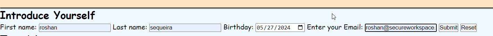

## Title - Taj Mahal 

## Purpose of the project. 
**"Taj Mahal - An Eternal calling"** website is a "one stop" source of information that caters to users of all ages and varied interests across fields. It provides first hand information based on authors ***"TWO"*** visits to the Taj Mahal. It is supported by pictures clicked by the author and includes a "link" to a published artcile articulating the authors thoughts.
As an example, a tourist may find useful information pertaining to ***"visit times"*** and ***"how to get there"***. Likewise anyone with interest in architecture can find useful information under ***"tickle your curosity"*** link on the landing page.Furthermore, details on the ***"information page"*** can be used to to arrive at decisons on the reasons to to visit the Taj. 
Visitors to the website can leave their details to get in touch with the author or upload their own experiences via the ***"upload files*** and image" section under the ***"Contact us" page***. 
 
 ## Features.
- The website is designed using the **"Mobile First"** Responsive approach using a structured layout and "meta" tags.  
- The website has four pages including the landing page.  **"Home", "Information", "Gallery" and "Contact Us"**.  
- The header includes the title of the website **" Taj Mahal- An Eternal Calling** and is common across all pages   
- The footer includes the **"copyright"** and **"author"** details and icons for social media  
- The chocie of foreground and background colors have the right contrast providing a rich user experience .  
- All images, including the hero image has a **"alt"** element to cater for the visually impaired.    
- All images in the gallery have the right resolution when viewed across screens with different viewports.  
- All External links open in a seperate tab **-"tickle your curosity"** on the home page and **"best time to visit"** section under the 
 information page.  
- CSS media queries are used where appropriate for different screen sizes.  
- Masonry layout used to align **images** in the **"Gallery"** page.  
- Relative paths are used for refering to folders and files.  
- Favicon is  included within the browser tabs and bookmarks bar is added for three different screen sizes.  
- **"Keywords"** and **"Description"** incldued for search engine optimization.  
- **"Hover"** property used to hightlight pages on navigation bar, social media icons and **"tickle your curosity"** link on landing page.

## Font family and colors.
- Google fonts used for styling. Download link:
  <https://fonts.googleapis.com/css2?family=Lato:ital,wght@0,100;0,300;0,400;0,700;0,900;1,100;1,300;1,400;1,700;1,900&family=Oswald:wght@200..700&display=swap>  
- Font-family used for styling : **"Cursive", Courier New', Courier, monospace**.
- Colors used for styling: **aliceblue,bisque,brown,cyan,crimson,gold,lightyellow,aqua, magenta,lightcyan**
        
## Technology used in development and testing.
- **Google Chrome** as the Browser.
- Cloud-based platform **gitpod.io** and **github** used for designing and hosting the website.
- Devices with different viewports for testing the responsiveness - **Galaxy A54, iPhone 14 Pro, Galaxy A25, Asus AMD Ryzen7 4800H with 
  Radeon Graphics**.

## Website pages and feature description 

### Home Page (landing page) 
- This page is divided into **three sections**- ***Head,Body and Footer***.
- The **Main** element contains the ***header and hero image***.
- The **Navigation bar** in the landing page includes links to **three other pages**- ***Information, Gallery and Contact_us page***.
  
 ### Head Section 
 #### Screenshot of main landing page
-.

- Language chosen is ***US English.***
- Meta tags ***"viewport" and "content"*** are included to make the page responsive.
- ***Keywords*** and ***description*** are added in the head section for **Search Engine Optimization**.
- The CSS stylesheet which is an external file is **linked** here in the head section.
- The favicon is displayed within the browser tabs and bookmarks bar is added for ***three different screen sizes***.
- The title **"Taj Mahal"** is defined here.

### Body Section.

- The body element contains ***"div"*** element nested within it are ***two child elements -"a" and "nav"***.
- The ***"nav"*** includes a ***"ul"*** with details of each page.
- The ***Hero*** image is inside a section under the ***Main*** element.
- It also includes the ***footer*** element, which has ***two "h2"*** elements nested within it and a ***"nav"*** which defines the ***"ul"*** for social media.
  
### Header. 
- The Header section is nested under the Body element.
- The Header is created using an ***H1 element*** with the content ***"Taj Mahal- An Eternal Calling"***.
- The header is **common** across all pages.
  
#### Header Screenshot.

### Navigation.  

- Contains a unordered list to define the three pages-***Home,Information Gallery and Contact Us***.
- **Hovering** the mouse over these changes the colour to **Cyan**.
- Flex properties applied to UL element nested under the NAV element
  
#### Navigation Screenshot with hover effect.

   

 ### Hero Image.  
 - The ***Heroimage*** was clicked by the author when he visited the TAJ.
 - Inside the hero image just below the header, there are two links.
 - Hovering the mouse over it ***changes the color to gold***.
 - **"Tickle your curosity"** Link, explains the architecture of the taj and has been sourced externally.
 - **Why is the Taj Special to me** link outlines users experiecne and throughts.
 - **Both** links open in a new tabs.

 #### Architecture of TAJ.png.
 
         
 
 #### "Why is Taj so special to me" is an article published by rediff.com sharing the authors experience.
 
 
 
 ### Footer. 
 
 - Displays the authorship of the website, copyright information and the social media.
 - Hovering mouse over the icons changes the color to **"cyan"**.
 - Clicking the social media icon opens in a new tab - ***home page or login page of that particular social media site***.
 - Each icon has a **"alt"** element to cater for the visually impaired.
 - The footer is **common** across all pages.
   
#### Screenshot of the Footer.

### Information Page.

#### Screenshot of the information page.

.  

- The information page has header **"h2"** titled" **!!! Explore the modern wonder of the world!!!**,followed by a short paragraph.
- The paragraph, contents created by the author explains the feelings one could experience.
- These feelings were experienced by the author on his visit.
- It also provides some information of past visitors and things to do.
- Four sections on this page provide additonal information.
- These sections are.
  1. Reasons to visit the **"Wow"** factor.
  2. Historical facts.
  3. How to get there.
  4. Best time to visit***(has an external clickable link)***.
- Flex properties were used.
  
#### Screenshot of "Best Time to visit"

   

### Gallery Page.

- Displays photographs taken by the author on his visit.
- **Masonry layout** along with media queries was used in style sheet to make this section responsive.

#### Screenshot of Gallery home page.

### Contact Us Page.

- This page is used to gather **visitor information**.
- This page also show a **live map** of Taj Mahal from **google maps.**
  
#### Screenshots of contact page.

## Future Features: 

- True to responsive coding priciples the website also needs to be responsive to future requirements and enhancements.
- The author plans to add a 3D video section, glowing features and more changes to the sytling and logic using Javascript.
  
## Testing 

### Code validation.

- W3school HTML validator was used to test the code. <https://validator.w3.org/>

#### Home Page validation result 
  

#### Information Page validation result 

#### Gallery page validation result 

#### Contact_us page validation result 

#### CSS validation.png.

- CSS validation service at <https://jigsaw.w3.org/css-validator/> was used to test the "style.css" sheet.
  

## Fixed bugs.

- The most bugs fixed were related to CSS styling using flexbox properties and sizing screens for display of images in the gallery.

## Deployment 

### via gitpod  

- First a GMAIL account was created by Code Institute
   

- Authorize Code institute for gitpod
  

  
- Every change post ***additon/modification/alteration*** of the code in gitpod.io was added to the Github respository using the fllowing three ccommands - **Git add . Git commit -m "meaninful comment". Git push - to push changes to Github** .

### via github pages
 

 

 

 

## Credits

### Referenced sites.

- **Fontawesome.com** website was used to download free fonts for the social media icons- Facebook, Twitter, Instagram and Youtube.
- An image **"architecture of the Taj"** was referenced from an external website <https://www.artefactindia.com/Taj-Mahal-and-its-marble-inlay-art>
- **Favicon code** was referenced from the Code Institute.
- **Masonry code** was referenced from the code institute.  

 ### Images 
 - The images used in this website were clicked by the author and hence ***copyright and ownership*** resides with the author.

### Understanding key concepts.  
- Basic concepts of flexbox - An excellent guide from Mozilla.org  and can be accessed here:
  <https://developer.mozilla.org/en-US/docs/Web/CSS/CSS_flexible_box_layout/Basic_concepts_of_flexbox.>
- Controlling ratios of flex items along the main axis- This is the guide I suggest users to read next.
  <https://developer.mozilla.org/en-US/docs/Web/CSS/CSS_flexible_box_layout/Controlling_ratios_of_flex_items_along_the_main_axis.>
- A Complete Guide to Flexbox : This is the a ready reference recokner to be kept handy while coding.
  <https://css-tricks.com/snippets/css/a-guide-to-flexbox/.>
- Flex Box from Code Institute <https://css-tricks.com/snippets/css/a-guide-to-flexbox/.>
- The Box Model Introduction part 2 - <https://learn.codeinstitute.net/login?next=/dashboard/>
- Httml Color Codes : <https://html-color.codes/.>
- Looking for a specific device’s viewport size? <https://viewportsizer.com/devices/.>
- ULTIMATE GUIDE: EM VS REM VS PX WHICH IS BETTER & WHY? <https://www.fhoke.com/em-vs-rem-vs-px/>

        

